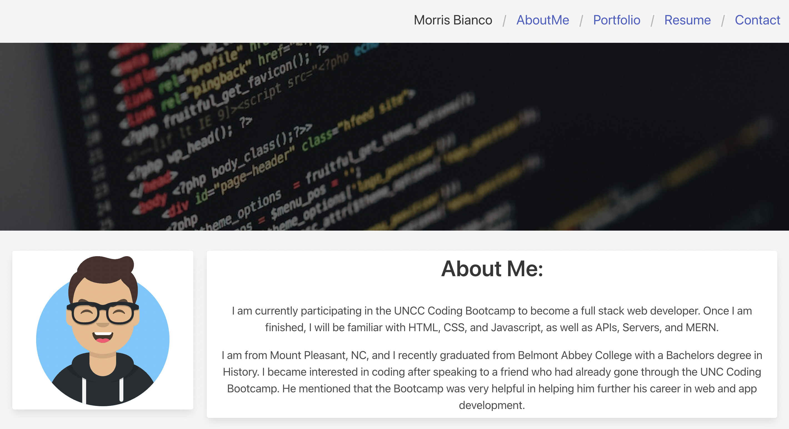
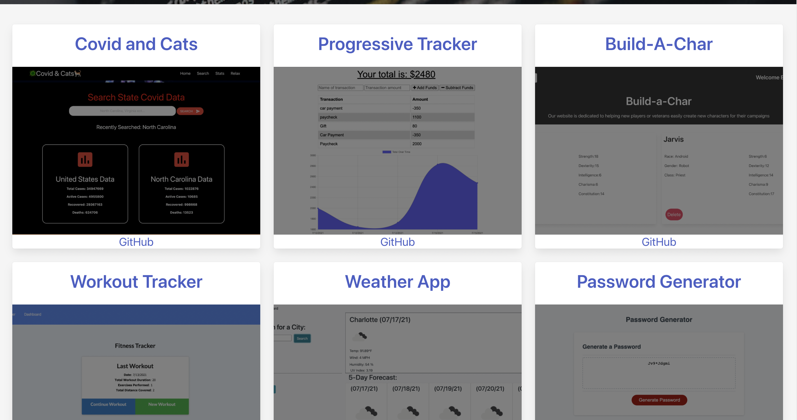
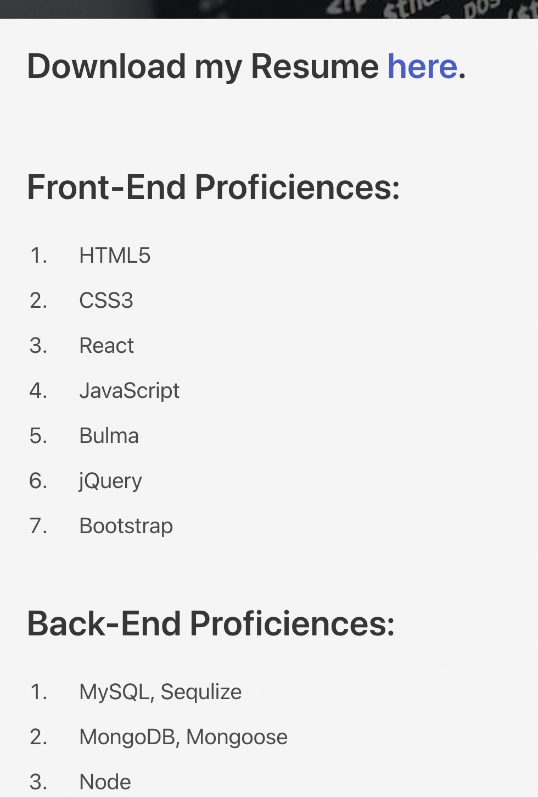
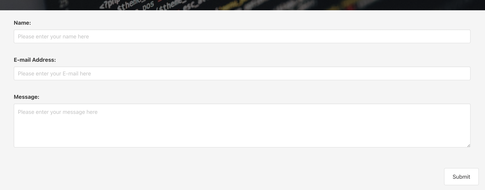

# React Portfolio Project

## Table of Contents
            
- [Description](#Description)
- [Usage](#Usage)
- [Questions](#Questions)

### Description

For this project, I was tasked to create a portfolio in React. To do this I took my old portfolio and redesigned it with React. To start the React portfolio, I created an about me page with my avatar and a short bio. 

Above the content of the about me section, there is a nav bar with links to different pages on my portfolio. Below the content, is a footer that contains links to my email, github, linkedin, and facebook. If you click on the portfolio page, it loads without refreshing and show my portfolio. On this page, I created six different cards with Bulma that display my projects. Clicking on the titles of the projects will link you to the website for that project. If you click on the github, it will take you to that project's github.

When you click on resume, it will take you to the resume page I made. There you will see a link to my resume where you can download it. You will also see a list of my proficiences in both front-end and back-end.

When you select the contact page, there is a form that will allow you to add your name, email, and message that you will like to send to me.

### Usage

To use this app, when you load the heroku link, it will take you to the about section of my portfolio. From there, you can select portfolio, resume, or contact links to see those pages. From the portfolio page, you can click on any of the titles to see that project or the github to see the github for that project. In resume, you can click on the link to view my resume. On the contact page, you can add your name, email, and message and hit submit. In the footer, you can click on any of the links to see my linkedin, facebook, or github. If you select the email, it will start an email draft to me.

You can view my portfolio here: https://mb-react-portfolio.herokuapp.com/

### Questions
My Github: https://github.com/morrisbianco

andrewbianco98@gmail.com: Please contact me through this E-mail address with any further questions that you may have.